# Core User Flows

## Overview
Complete end-to-end user flows for PocketTherapy's core features, designed with anxiety-informed principles including gentle defaults, offline-first functionality, and SOS-first access patterns.

## 1. App Launch & Onboarding Flow

### Cold Start Flow
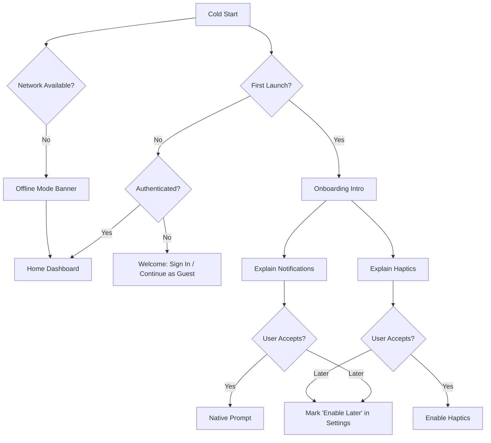

### Onboarding Steps
1. **Welcome Screen**: Introduction to PocketTherapy
2. **Purpose Selection**: What brings you here today?
3. **Baseline Mood**: Initial mood assessment
4. **Notification Preferences**: Gentle reminder settings
5. **Ready to Begin**: Personalized summary and first steps

### Guest vs Authenticated Flow
```typescript
const authenticationFlow = {
  guest: {
    features: ['mood_tracking', 'exercises', 'offline_mode'],
    limitations: ['no_sync', 'no_insights', 'local_data_only'],
    upgrade_prompts: ['after_7_days', 'before_data_loss']
  },
  authenticated: {
    features: ['full_access', 'cloud_sync', 'insights', 'cross_device'],
    providers: ['google', 'apple', 'email']
  }
};
```

## 2. Mood Check-in Flow

### Primary Check-in Flow
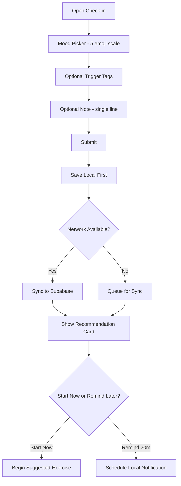

### Crisis Detection Flow
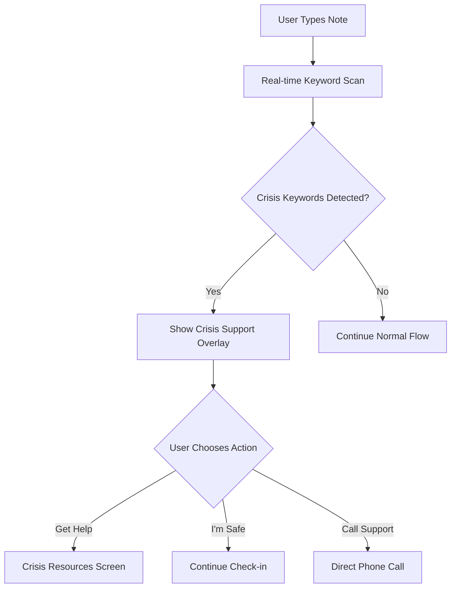

### Mood Check-in States
```typescript
const moodCheckStates = {
  entry_points: [
    'home_dashboard_card',
    'notification_reminder',
    'sos_post_exercise',
    'manual_navigation'
  ],
  completion_actions: [
    'show_exercise_recommendation',
    'schedule_reminder',
    'return_to_home',
    'start_exercise_immediately'
  ],
  crisis_triggers: [
    'keyword_detection',
    'mood_1_selected',
    'multiple_low_moods',
    'user_request_help'
  ]
};
```

## 3. Exercise Flow

### Exercise Discovery Flow
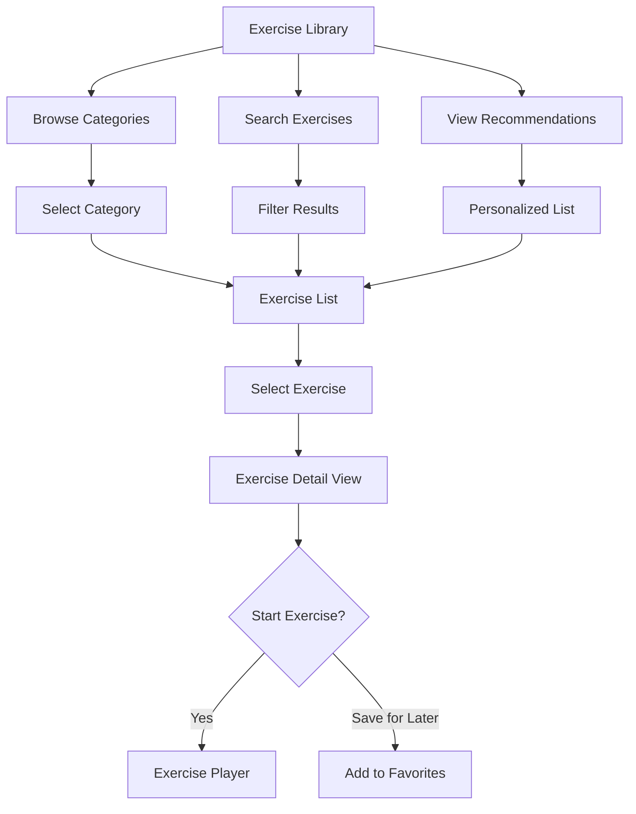

### Exercise Player Flow
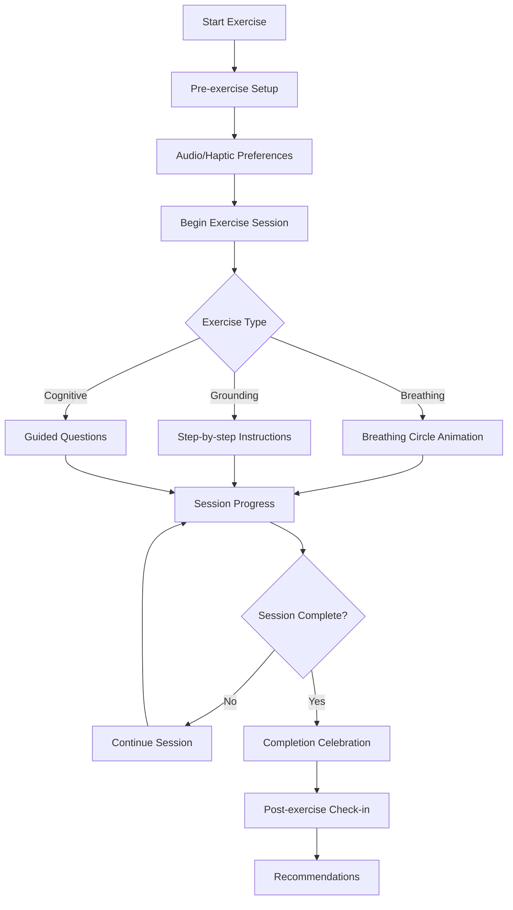

### Exercise Interruption Handling
```typescript
const interruptionHandling = {
  phone_call: {
    action: 'pause_automatically',
    resume: 'show_resume_option',
    timeout: '5_minutes'
  },
  app_background: {
    action: 'pause_with_notification',
    resume: 'automatic_on_foreground',
    state_preservation: 'full'
  },
  low_battery: {
    action: 'offer_audio_only_mode',
    fallback: 'graceful_completion'
  }
};
```

## 4. SOS Crisis Flow

### Immediate Crisis Response
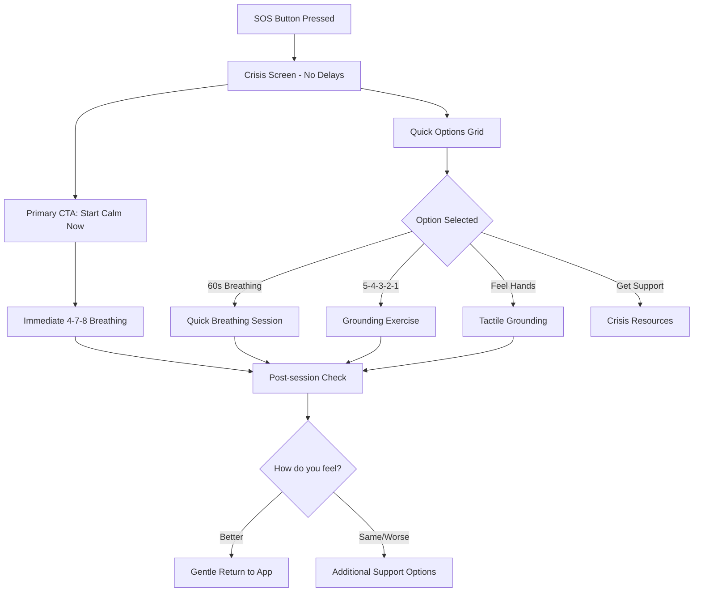

### Crisis Resource Access
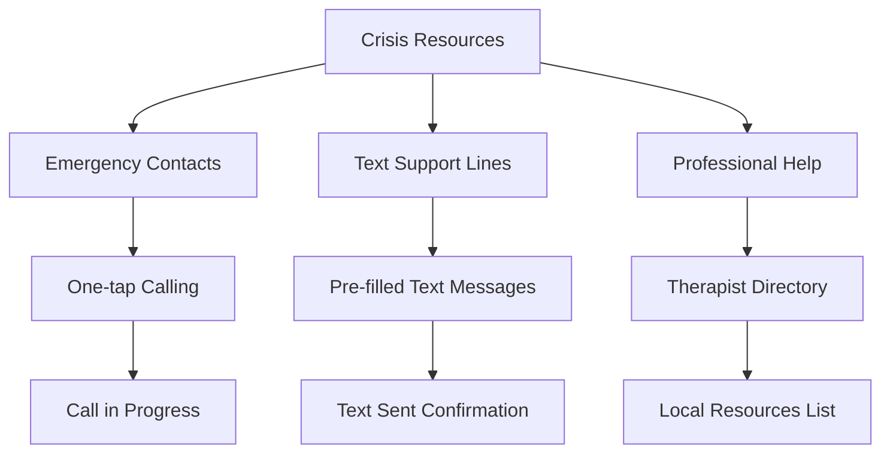

## 5. Insights & Progress Flow

### Data Visualization Flow
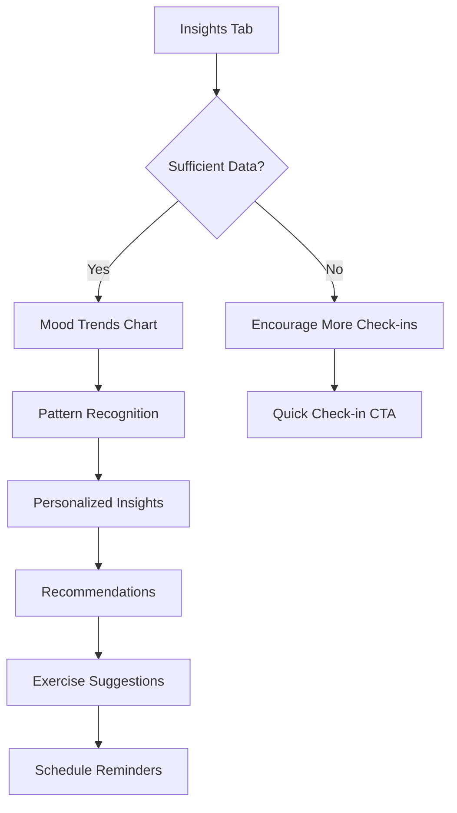

### Progress Tracking Elements
```typescript
const progressMetrics = {
  mood_trends: {
    timeframes: ['7_days', '30_days', '3_months'],
    visualizations: ['line_chart', 'mood_calendar', 'weekly_summary']
  },
  exercise_completion: {
    metrics: ['total_sessions', 'streak_count', 'favorite_exercises'],
    achievements: ['consistency_badges', 'milestone_celebrations']
  },
  pattern_insights: {
    detected_patterns: ['time_of_day', 'trigger_correlations', 'improvement_trends'],
    recommendations: ['optimal_exercise_times', 'trigger_management', 'habit_suggestions']
  }
};
```

## 6. Settings & Preferences Flow

### Settings Navigation
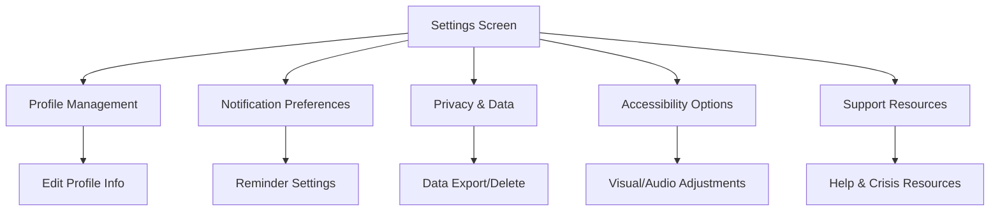

## 7. Offline-First Flow Patterns

### Offline Capability Matrix
```typescript
const offlineCapabilities = {
  fully_offline: [
    'mood_check_ins',
    'breathing_exercises',
    'grounding_exercises',
    'crisis_support_resources',
    'local_data_viewing'
  ],
  requires_sync: [
    'insights_generation',
    'exercise_library_updates',
    'cloud_backup',
    'cross_device_sync'
  ],
  graceful_degradation: [
    'show_cached_content',
    'queue_actions_for_sync',
    'offline_mode_indicators',
    'sync_when_online'
  ]
};
```

### Sync Conflict Resolution
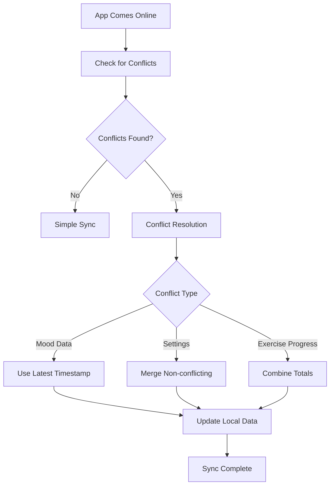

## Flow Design Principles

### Anxiety-Informed Design
1. **Immediate Access**: SOS features available from any screen
2. **Gentle Defaults**: Non-alarming colors and language
3. **Predictable Navigation**: Consistent patterns reduce cognitive load
4. **Offline Resilience**: Core features work without internet
5. **Crisis Safety**: No barriers to emergency support

### User Experience Priorities
1. **Speed to Relief**: Minimize taps to therapeutic content
2. **Data Privacy**: Local-first with optional cloud sync
3. **Accessibility**: Full screen reader and motor accessibility
4. **Personalization**: Adaptive recommendations based on usage
5. **Gentle Guidance**: Supportive language throughout flows

## 8. Notification Flow Patterns

### Daily Reminder Flow
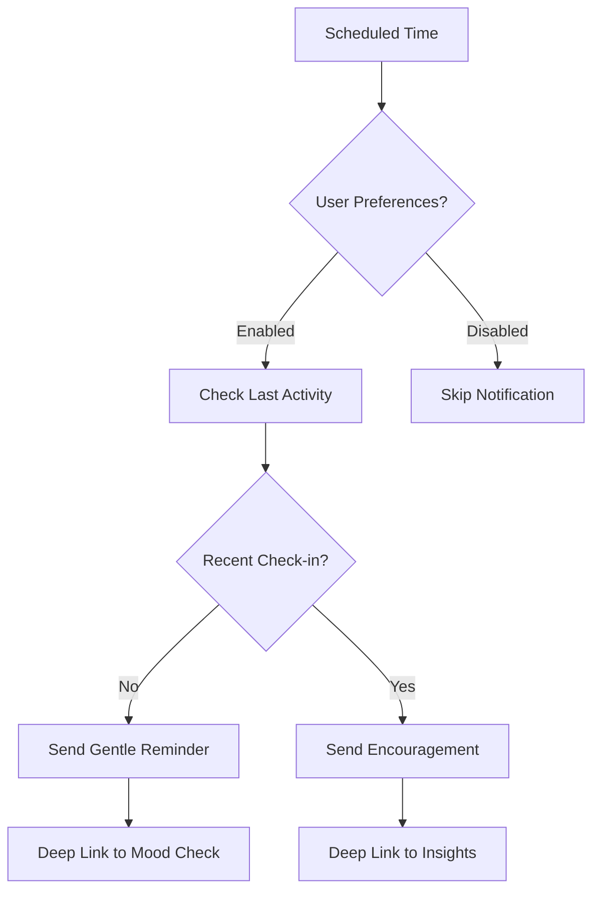

### Crisis Follow-up Flow
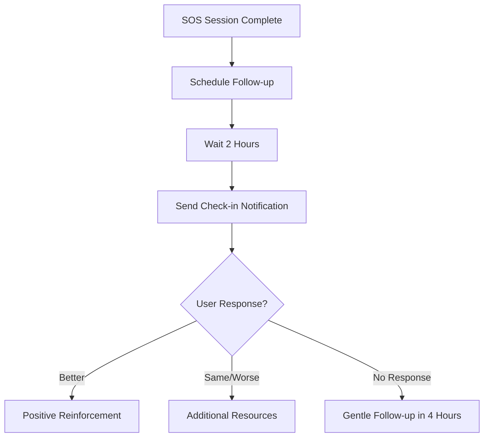

## 9. Micro-Interaction Flows

### Quick Session Flow (30 seconds)
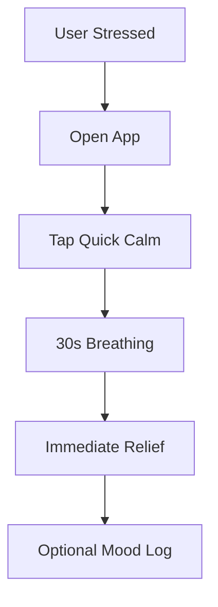

### Habit Building Flow
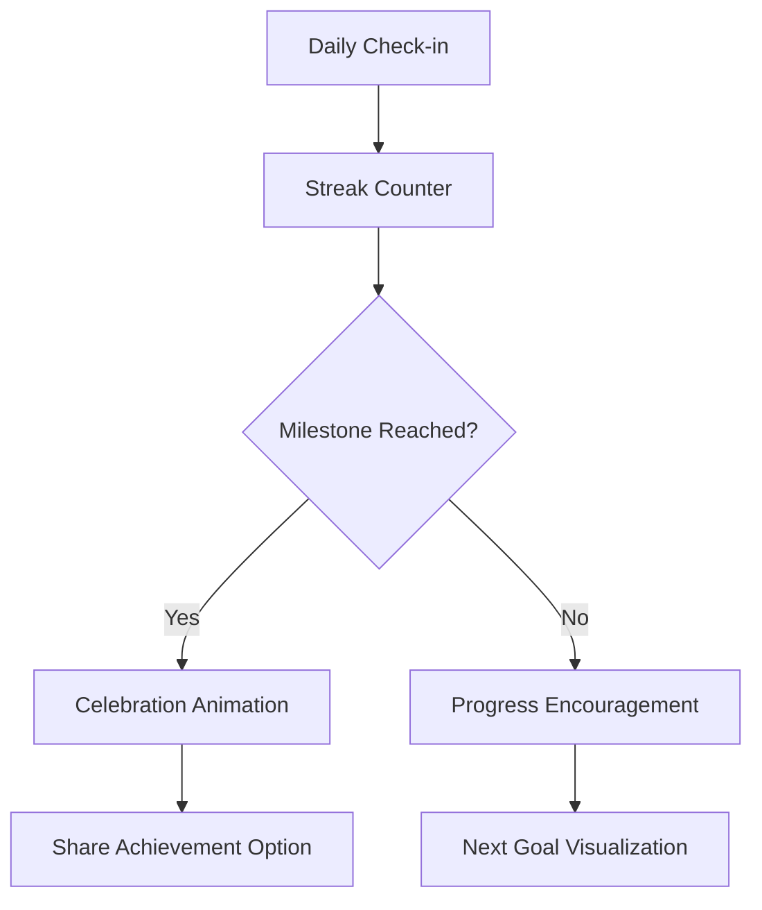

These comprehensive user flows ensure that PocketTherapy provides immediate, accessible mental health support while maintaining user privacy and safety in all interaction patterns.
